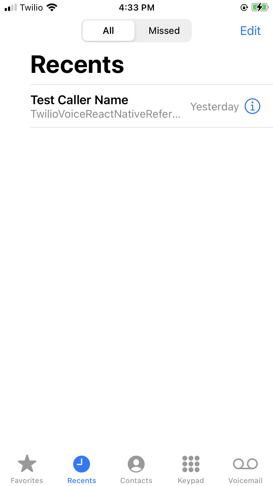

# How to start a call from the iOS Phone app history (iOS 13+)

In the example tutorial, you will learn the steps of starting a call by tapping the entries of the app's previous call history in the iOS Phone app.



### Add start-call intents to you app's Info.plist file (file name may vary)

```
	<key>NSUserActivityTypes</key>
	<array>
		<string>INStartAudioCallIntent</string>
		<string>INStartCallIntent</string>
	</array>
```

### Add an observer and handler to the `INStartCallIntent` notification in the SDK event emitter

```
#import <Intents/Intents.h>

- (void)subscribeToNotifications {
    // Event emitter class initialization
    [[NSNotificationCenter defaultCenter] addObserver:self
                                             selector:@selector(startCallFromIntent:)
                                                 name:@"INStartCallIntent"
                                               object:nil];
}

- (void)startCallFromIntent:(NSNotification *)notification {
    if (!notification.userInfo[@"contact"]) {
        NSLog(@"Contact not found from the start-call intent");
        return;
    }
    
    INPerson *person = notification.userInfo[@"contact"];
    [self makeCallWithAccessToken:self.accessToken
                           params:@{@"number": person.personHandle.value}
                    contactHandle:person.personHandle.value];
}
```

### Implement the user-activity callback methods in the iOS app's `AppDelegate.m` file (file name may vary) to handle the start-call intent. Post a notification so the event emitter class can start the call.

```
#import <Intents/Intents.h>

- (BOOL)application:(UIApplication *)application willContinueUserActivityWithType:(NSString *)userActivityType {
    return YES;
}

- (BOOL)application:(UIApplication *)application
continueUserActivity:(NSUserActivity *)userActivity
 restorationHandler:(void (^)(NSArray<id<UIUserActivityRestoring>> *))restorationHandler {
    if (@available(iOS 13, *)) {
        if ([userActivity.activityType isEqual:@"INStartCallIntent"]) {
            INInteraction *interaction = userActivity.interaction;
            INStartCallIntent *intent = (INStartCallIntent *)interaction.intent;

            if ([intent.contacts count] == 0) {
                return NO;
            }
      
            INPerson *person = intent.contacts[0];
            // Add observer to the event emitter class to handle the "INStartCallIntent" event
            [[NSNotificationCenter defaultCenter] postNotificationName:@"INStartCallIntent"
                                                                object:nil
                                                              userInfo:@{@"contact": person}];
        }
    }

    return YES;
}
```

### Set up CallKit supported handle type

Use the `Voice.setCallKitConfiguration()` method of the Twilio Voice React Native SDK and specify `Generic` and `PhoneNumber` as the value of `callKitSupportedHandleTypes`.

```
  const callKitConfiguration = CallKit.ConfigurationOptions(
  	callKitSupportedHandleTypes = [ HandleType.Generic, HandleType.PhoneNumber ];
  );
  
  await Voice.setCallKitConfiguration(callKitConfiguration);
```